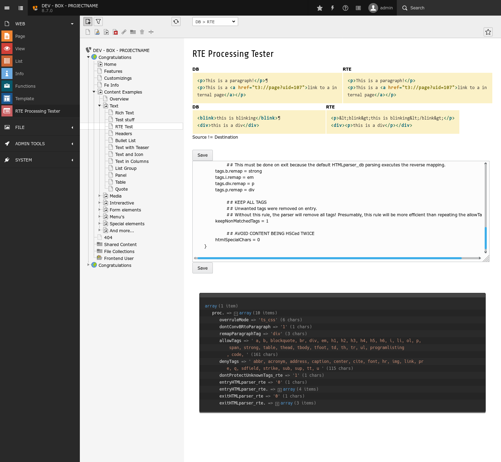

.. include:: ../Includes.txt

Introduction
============

What does it do?
----------------

This extension provides a backend module for testing rich text editor content processing configuration.

You can use this extension (backend module) to quickly test your RTE processing configuration. This is a developer tool.

This is not a tool to configure the RTE itself!

Screenshots
-----------

The module looks like this:

    the backend module in action

Status
-------

This tool might need some adjustments for TYPO3 8.x and later. It was once build when the HtmlArea RTE was used in TYPO3.
Nowadays the CKEditor is used. The processing is still the same but the configuration slightly changed.

To do
^^^^^

* provide a meaningful configuration as starting point
* support the YAML configuration introduced with CKEditor
* support custom path to config file

